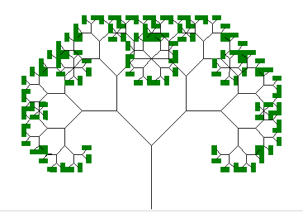
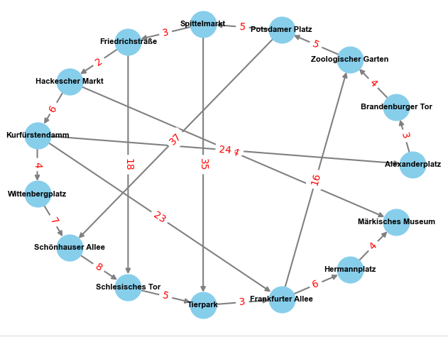
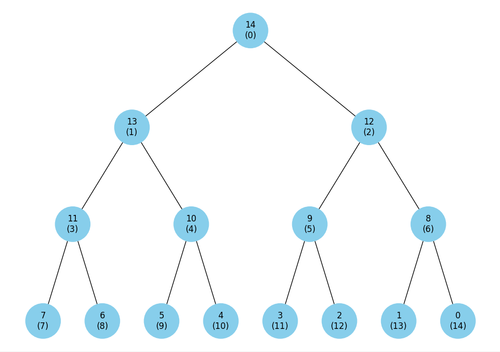
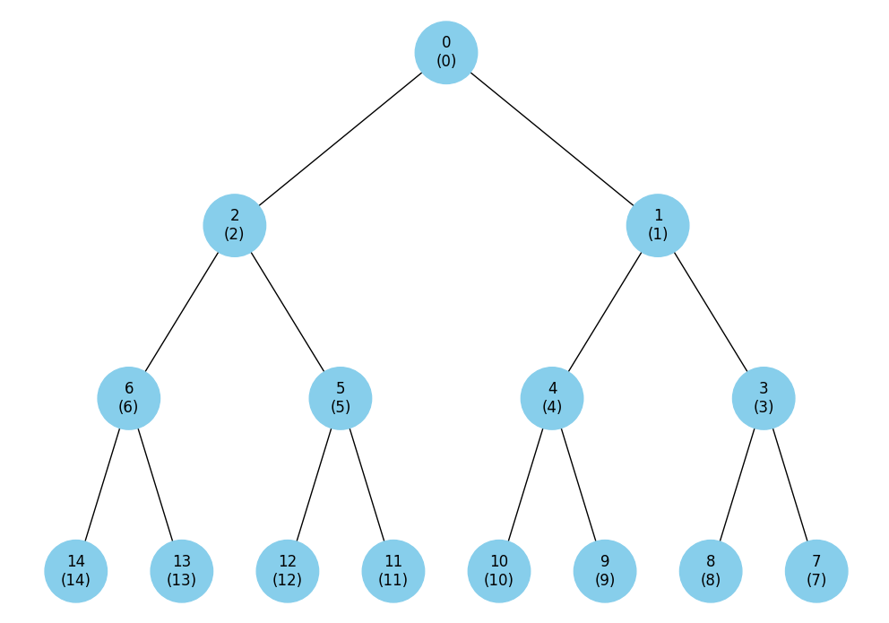
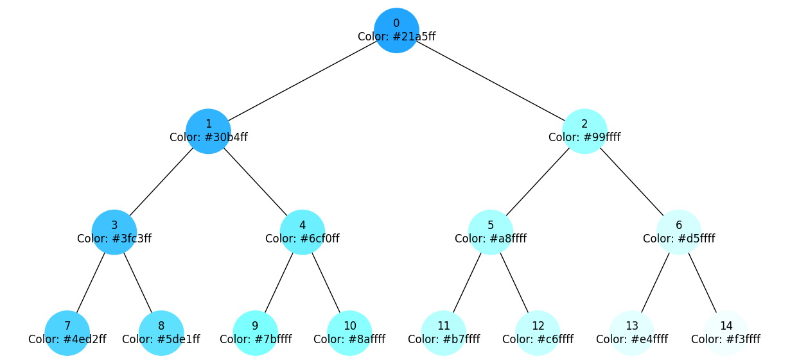
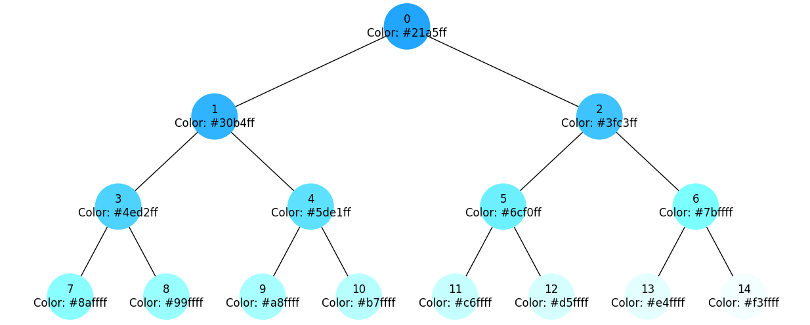
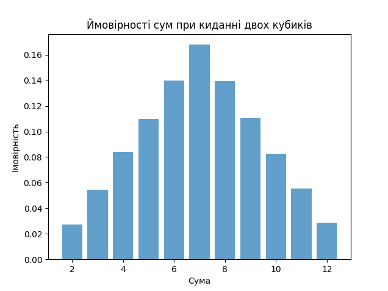

# Фінальний проект "Basic Algorithms and Data Structures"

## Task 1

### Структури даних. Сортування. Робота з однозв'язним списком

| Зв'язний список:  |
| ----------------- |
| 15, 10, 5, 20, 25 |

| Зв'язний список після видалення вузла з даними 10: |
| -------------------------------------------------- |
| 15, 5, 20, 25                                      |

| Шукаємо елемент 15: |
| ------------------- |
| 15                  |

| Зв'язний список після реверсу: |
| ------------------------------ |
| 25, 20, 5, 15                  |

| Другий зв'язний список: |
| ----------------------- |
| 7, 12, 18               |

| Відсортований об'єднаний список: |
| -------------------------------- |
| 7, 12, 18, 25, 20, 5, 15         |

## Task 2

### Рекурсія. Створення фрактала “дерево Піфагора” за допомогою рекурсії

## Task 3

### Дерева, алгоритм Дейкстри

### Граф метро Берліну

### Найкоротши шляхі від початкової вершини до всіх інших

| Station             | Shortest Distance |
| ------------------- | ----------------- |
| Alexanderplatz      | 0                 |
| Brandenburger Tor   | 3                 |
| Zoologischer Garten | 7                 |
| Potsdamer Platz     | 12                |
| Spittelmarkt        | 17                |
| Friedrichstraße     | 20                |
| Hackescher Markt    | 22                |
| Kurfürstendamm      | 28                |
| Wittenbergplatz     | 32                |
| Schönhauser Allee   | 39                |
| Schlesisches Tor    | 38                |
| Tierpark            | 43                |
| Frankfurter Allee   | 46                |
| Hermannplatz        | 52                |
| Märkisches Museum   | 56                |

## Task 4

### Візуалізація піраміди

### Максимальна купа (Max Heap)

### Мінімальна купа (Min Heap)

## Task 5

### Візуалізація обходу бінарного дерева

### Візуалізація обхода дерева у глибину

### Візуалізація обхода дерева у ширину

## Task 6

### Жадібні алгоритми та динамічне програмування

### Жадібний алгоритм обчислює оптимальний набір страв при заданому бюджеті: 100:

### Жадібний алгоритм:

- Обрані страви: ['cola', 'potato', 'pepsi', 'hot-dog']
- Калорійність: 870
- Фінальні витрати: 80
- Співвідношення калорій до вартості: 10.88

### Алгоритм динамічного програмування обчислює оптимальний набір страв при заданому бюджеті: 100:

### Алгоритм динамічного програмування:

- Обрані страви: {'pizza': 1, 'pepsi': 1, 'cola': 1, 'potato': 1}
- Калорійність: 970
- Фінальні витрати: 100
- Співвідношення калорій до вартості: 9.70

## Task 7

### Використання методу Монте-Карло

| Сума | Імовірність   |
| ---- | ------------- |
| 2    | 2.79% (1/36)  |
| 3    | 5.56% (1/36)  |
| 4    | 8.38% (1/36)  |
| 5    | 11.12% (1/36) |
| 6    | 13.88% (1/36) |
| 7    | 16.65% (1/36) |
| 8    | 13.89% (1/36) |
| 9    | 11.10% (1/36) |
| 10   | 8.34% (1/36)  |
| 11   | 5.52% (1/36)  |
| 12   | 2.78% (1/36)  |

### Висновки:

Результати симуляції методом Монте-Карло добре узгоджуються з аналітичними розрахунками. Відмінна узгодженість результатів підтверджує правильність симуляції та адекватність моделі для даного експерименту. Метод Монте-Карло є добрим інструментом для апроксимації ймовірностей у складних випадках, і його застосування в даному завданні дало точні результати.
